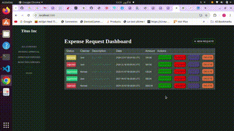

#   Expense-Claims

>  Expense-Claims is a small web application where everyone can add expense: there are  a list of fields  associated with an expense, so that any employee can approve or reject an expense request.
This application allow user :

   - Add new claim request
   - Update an existant request
   - Approve, reject an existant request
   - Delete an existant request
   - Display bar chart for expense stats per month

<p align="center">
  
</p>


## Built With
- Ruby
- git
- Rails
- postgresql

## Live Demo

[Live Demo Link](https://optimize-my-budget.herokuapp.com/)

## Getting Started

To get a local copy up and running follow these simple example steps.
- Open terminal
- Clone this project by the command: 

```
$ git clone git@github.com:taher-software/expense_claims_app.git
```

- Then go to the main folder using the next command:

```
$ cd expense_claims_app.
```
- Install Ruby gems using this command line:

```
$ bundle install in your console.
```

- set db credentials: 
```
export PGSQL_USERNAME='postgresql_username'
export PGSQL_PWD='postgresql_password'
```
- create db by: 
```
rails db:create
```
- run migration by: 
```
rails db:migrate
```
- populate db by: 
```
rails db:seed
```
- Finaly , run <b> rails s </b> to run the application.

## Authors

👤 **Taher Haggui**

- GitHub: [@Taher-web-dev](https://github.com/Taher-web-dev)

## 🤝 Contributing

Contributions, issues, and feature requests are welcome!

Feel free to check the [issues page](../../issues/).

## Show your support

Give a ⭐️ if you like this project!

